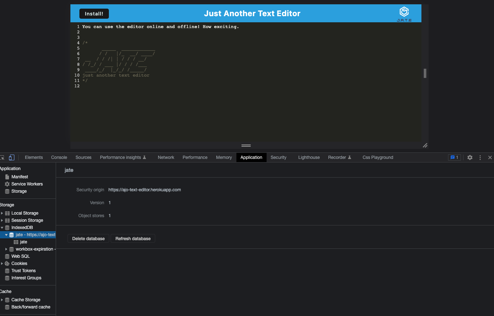

# PWA Text Editor

  
  

  
  
  ## Live Deployment
  
  [Use the PWA Text Editor on Heroku](https://ajo-text-editor.herokuapp.com/)
  
  ## Description
  This is a single-page web application build using Progressive Web Application(PWA) criteria. The user is able to access the app online and offline through the use of data persistant features like IndexedDB, cache, and local storage.
  
  ## Table of Contents
  - [Installation](#installation)
  - [Usage](#usage)
  - [Contributing](#contributing)
  - [License](#license)
  
  ## Installation
  This application requires Node.js. Clone the repo and run the usage commands below.
  
  ## Usage
  To use this application locally, you may enter the following commands: 
  
  Install dependencies: `npm install`; 

  Start the application: `npm run start`; 
  
  Start the application in development mode: `npm run start:dev`; 
  
  For other custom scripts, please refer to the package.json at the root level.
  
  ## License
  Read more about MIT here: [MIT](https://opensource.org/licenses/MIT)
  
  ## Contributing
  Please fork the repository.
  
  ## Questions
  - GitHub: [View my profile](https://github.com/ajolsavsky)
  - Email: alexandraolsavsky@gmail.com
  